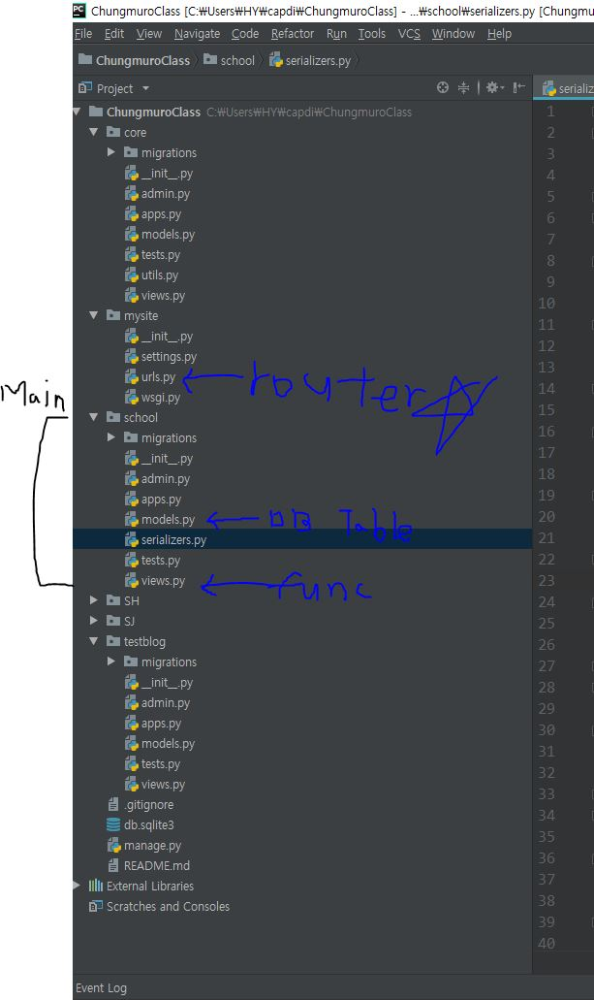

# TEAM ChungmuroClass
This is server source code(Python)

Client(Android) source code is in https://github.com/HoYoung1/Chungmuroclass2  
ㅡㅡㅡㅡㅡㅡㅡㅡㅡㅡㅡㅡㅡㅡㅡㅡㅡㅡㅡㅡㅡㅡㅡㅡㅡㅡㅡㅡㅡㅡㅡㅡㅡㅡㅡㅡㅡㅡㅡㅡㅡㅡㅡㅡㅡㅡㅡㅡㅡㅡㅡㅡㅡㅡ  
  
**2018-1 동국대 캡스톤디자인 프로젝트**  

프로젝트명 : 얼굴 인식을 통한 자동출석체크 시스템    
사용대상 : 서버 관리자  
소프트웨어 : Python , Django-Framework  
설명 : 학사시스템이라고 가정, 출석체크 프로세스가 진행되는 웹 서버  

ㅡㅡㅡㅡㅡㅡㅡㅡㅡㅡㅡㅡㅡㅡㅡㅡㅡㅡㅡㅡㅡㅡㅡㅡㅡㅡㅡㅡㅡㅡㅡㅡㅡㅡㅡㅡㅡㅡㅡㅡㅡㅡㅡㅡㅡㅡㅡㅡㅡㅡㅡㅡㅡㅡ  
**소스코드 내용 :**  

1. Django-rest-Framework 활용해 필요한 Restful api 구성 
2. cv2활용 카메라 모듈(1분단위로 촬영 후 AWS S3 Storage저장), 
3. AWS rekognition Face-detect api 활용해 얼굴 인식 후 draw 라이브러리 활용해 얼굴 Highlight , 
4. AWS rekognition Face-compare api 활용해 일정 similar 이상 일 때 얼굴 사진 추출,  
=> 추출된 사진은 서버에 저장되며, S3 storage와 동기화 시켜 확인이 가능합니다.
5. 추출된 얼굴 사진들을 이용해 구글 인셉션으로 이미지(얼굴사진) 학습 및 출석체크에 활용  
=> Django-background-tasks를 활용해 매일 자정 배치를 돌려 당일에 수집된 이미지를 계속 학습시킵니다. 

ㅡㅡㅡㅡㅡㅡㅡㅡㅡㅡㅡㅡㅡㅡㅡㅡㅡㅡㅡㅡㅡㅡㅡㅡㅡㅡㅡㅡㅡㅡㅡㅡㅡㅡㅡㅡㅡㅡㅡㅡㅡㅡㅡㅡㅡㅡㅡㅡㅡㅡㅡㅡㅡㅡ

ㅡㅡㅡㅡㅡㅡㅡㅡㅡㅡㅡㅡㅡㅡㅡㅡㅡㅡㅡㅡㅡㅡㅡㅡㅡㅡㅡㅡㅡㅡㅡㅡㅡㅡㅡㅡㅡㅡㅡㅡㅡㅡㅡㅡㅡㅡㅡㅡㅡㅡㅡㅡㅡㅡ
# How to use :

$git clone https://github.com/HoYoung1/ChungmuroClass.git

$cd ChungmuroClass

$pip install django

$pip install djangorestframework

(python3 or python)
$python3 manage.py makemigrations

$python3 manage.py migrate

$python3 manage.py runserver

**another seesion**  
$python3 manage.py process_tasks
